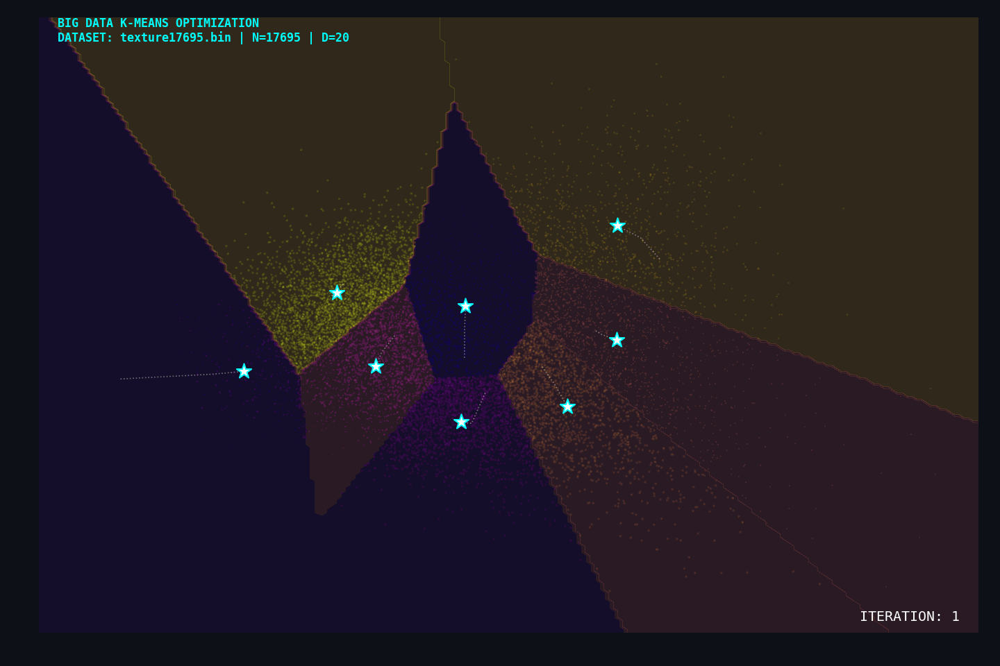
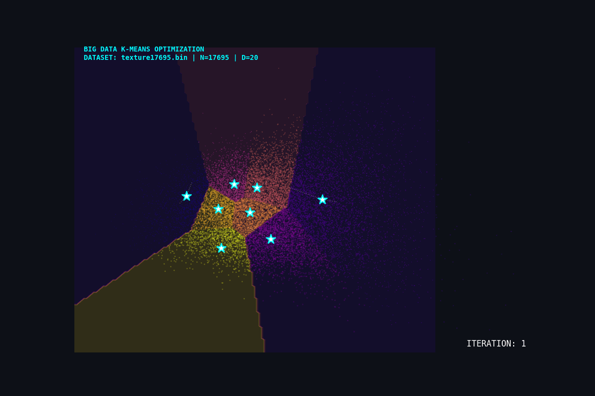

# K-means Clustering 

A performance engineered K-means clustering implementation optimized for multi-core CPU architectures using OpenMP.

<p align="center">

</p>

Developed as part of the ECE415: High Performance Computing Systems course, this project focuses on the parallelization and optimization of the K-means clustering algorithm. The implementation was iteratively refined using Intel VTune profiling to minimize synchronization bottlenecks and maximize hardware utilization on multi-socket Xeon systems.

Status: Completed. Achieved an 18.41× speedup over the sequential baseline using thread-local accumulation and dynamic load balancing.

## What it does 
This simulation partitions large scale multidimensional datasets into K distinct clusters. By isolating per thread workloads, the implementation avoids the heavy synchronization typically required when updating shared cluster centers in parallel.

<p align="center">

</p>
The animation above represents the algorithm processing the texture17695.bin dataset—containing 17,695 objects with 20 feature dimensions each—projected into 2D via Principal Component Analysis (PCA).


## Project Structure
```text
kmeans-openmp-performance/
├── src/
│   ├── Makefile            # Build configuration (icx + OpenMP)
│   ├── seq_kmeans.c        # Main parallel implementation
│   └── ...                 # Additional source files
├── docs/
│   └── report.pdf          # Detailed optimization analysis
├── visualization/
│   ├── kmeans_big_data.gif # High-density clustering animation
│   └── animation.py        # PCA and visualization script
└── README.md
```

## Design & Optimization Overview
1. Baseline (Sequential): Initial reference implementation used for performance tracking. (Runtime: 3.480 s).
2. Hotspot Identification: Used Intel VTune to identify euclid_dist_2 as the primary hotspot.
3. SIMD & Loop Parallelization: Attempted to parallelize the internal coordinate loops. Dismissed due to high thread creation overhead for small 20D vectors.
4. Assignment Step Optimization: Parallelized the find_nearest_cluster loop. While correct, initial attempts using global critical sections for min-distance tracking limited scaling.
5. Thread Local Accumulation: Implemented a strategy where each thread manages its own localClusters and localClusterSize buffers. This allowed threads to work independently, performing a single "safe merge" into global memory at the end of each iteration.
6. Scheduling & Load Balancing: Evaluated multiple scheduling policies, ultimately selecting schedule(dynamic, 25) to handle potential load imbalances across high dimensional feature vectors


## Performance Results
Performance was evaluated using the texture17695.bin benchmark dataset.

| Implementation | Execution Time | Speedup |
| :--- | :--- | :--- | 
| **Sequencial Baseline** | 	3.480 s | 1.00× |
| **Final Optimization** | 0.189 s | **18.41×** |


### Test Environment
* **CPU:** 2× Intel Xeon E5-2695 v3 @ 2.30GHz
* **RAM:** 128 GiB
* **GPU:** 2× NVIDIA Tesla K80 (Provides 4× logical GK210GL GPUs)
* **Server:** `csl-venus`


## Build
This project uses Intel oneAPI `icx` with OpenMP enabled (per `src/Makefile`):
```bash
make -C src
```
## Run 
```bash
./src/seq_main -q -b -n 4 -i Image_data/color17695.bin
./src/seq_main -q    -n 4 -i Image_data/color100.txt
```
## Clean
```bash
make -C src clean
```
## Scaling  
Control threads via:  
 `OMP_NUM_THREADS=<N>`


